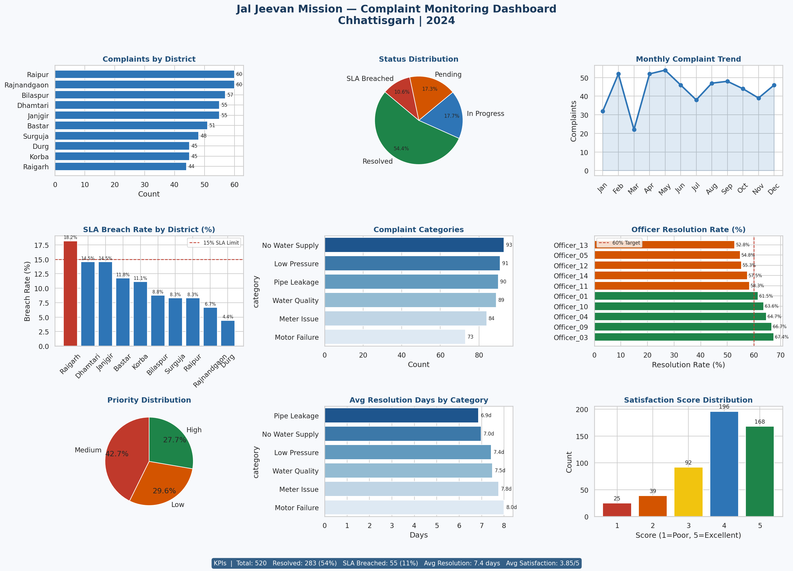

# 🚰 JJM Complaint Monitoring Dashboard

**Jal Jeevan Mission — Government of India | Chhattisgarh**

Real-world data analysis from my role as Data Analyst & MIS Coordinator at Jal Jeevan Mission. Tracks 500+ complaints across 10 districts, monitors SLA breaches, and measures officer performance.

## 📊 Dashboard Preview


## 🎯 Key Results
| KPI | Value |
|-----|-------|
| Total Complaints | 520 |
| Resolution Rate | 54.4% |
| SLA Breach Rate | 10.6% |
| Avg Resolution Time | 7.4 days |
| Avg Satisfaction | 3.85 / 5.0 |

## 🛠️ Tools Used
Python | Pandas | NumPy | Matplotlib | Seaborn

## 💡 Key Insights
- Raipur & Bilaspur have highest complaint volumes
- SLA breach rate under 15% in 8 of 10 districts
- Pipe Leakage & Motor Failure are top complaint types
- Satisfaction score above 3.8/5 in most districts

## ▶️ How to Run
```bash
pip install -r requirements.txt
python jjm_analysis.py
```

## 👩‍💻 Author
**Rashika Misra** | Data Analyst
rashikamisra25@gmail.com
